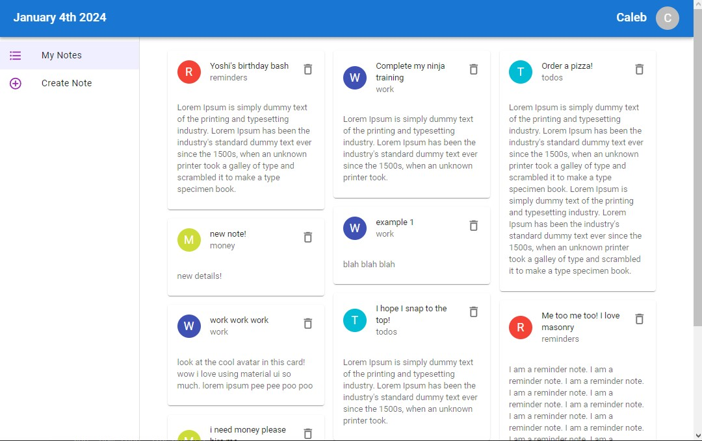
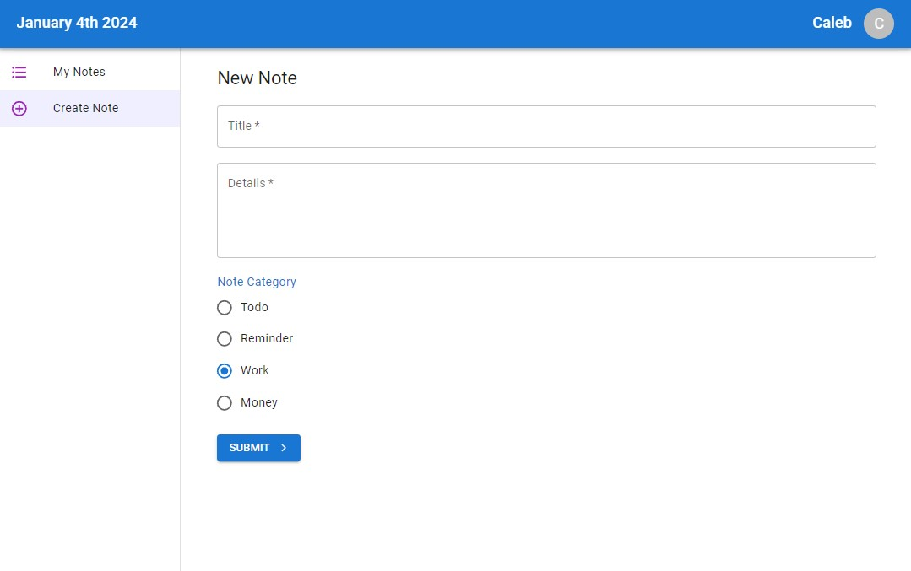

# Overview

This React project was created to explore Material UI.

It is a basic notes application with CRUD functionality.

It uses a ton of MUI components, including the experimental `<Masonry>` component.

# To Run
- Make sure you have recent versions of Node, npm, npx installed.
- Clone this repository
- Navigate to the root folder: `cd material-ui-tut`
- Get all the necessary packages: `npm install`
- Run the frontend: `npm run dev`
- In a separate terminal, start the mock database: `npm run db`
- Go to http://localhost:5173 to see the application working.
- Try adding a new note and see it appear in the Notes page, as well is in the `data/db.json` file.
- If you run into issues, 🤷‍♂️

# Screenshots

If you don't want to run this yourself to see what it looks like, I'll save you the trouble:

### Notes Page

### New Note Page

## References
I followed a video series by Net Ninja on YouTube, which can be found [here](https://www.youtube.com/watch?v=0KEpWHtG10M&list=PL4cUxeGkcC9gjxLvV4VEkZ6H6H4yWuS58).

Note that it uses old versions of React, react-router-dom, and MUI v5 instead of MUI v6. Several changes were made both out of necessity and creative liberty.
